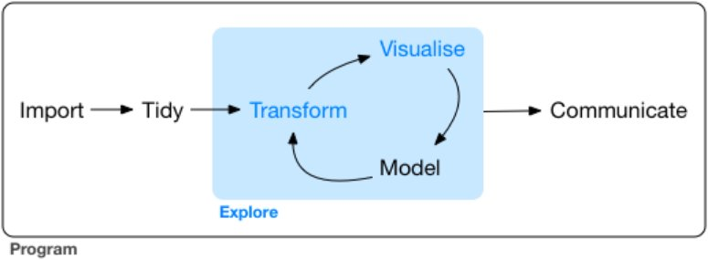

Explore
========================================================
author: Wim van der Ham
date: 2018-05-30
autosize: true

Explore - Work Flow
========================================================



ggplot2
========================================================

- ggplot()
- [geom_*](http://ggplot2.tidyverse.org/reference/index.html#section-layer-geoms)
- aes()

Examples in the `explore.R` file

Labels
========================================================

**Always** label your axis and use a title

Title should be a conclusion, not a description

Best Type of Graphics
========================================================

| Type of variable 1 | Type of variable 2 | Best Graphic |
| --- | --- | --- |
| Discrete | Discrete | geom_bar |
| Discrete | Continuous | geom_boxplot |
| Continuous | Continuous | geom_point* |

* When there is too much data, one of the variables has to be changed to discrete using `cut()`.

Pipe %>%
========================================================


```r
sin(sqrt(log(10)))
```

```
[1] 0.9985762
```


```r
10 %>%
  log %>%
  sqrt %>%
  sin
```

```
[1] 0.9985762
```

dplyr - Most important functions
========================================================

| function | description | SQL |
| --- | --- | --- |
| `select()` | Select specific columns | SELECT |
| `filter()` | Filter rows using a condition | WHERE |
| `group_by()` | Make groups | GROUP BY |
| `arrange()` | Sort | ORDER BY |
| `summarise()` | Calculate some values per group | |
| `mutate()` | Add a new column using a function | |

dplyr - Examples
========================================================

Examples in the `explore.R` file

Exercise - Load Data
========================================================


```r
# install.packages("nycflights13")
library(nycflights13)
flights <- as_data_frame(flights)
?flights
```

Exercise - Questions 1
========================================================

1. Which columns have `NA` values?
1. How many flights are there on 1^th January 2013?
1. What is the largest distance (in km!) between two airports? Also give the names of the airports.
1. How many different destinations are there?

Exercise - Questions 1 with Tips
========================================================

- How many flights are there on 1^th January 2013? 
  
  `filter(day == ... & month == ...)`
- What is the largest distance (in km!) between two airports? Also give the names of the airports.

  `mutate(distance_km = distance * 1.60934)`
- How many different destinations are there?

  `group_by(dest)`

Exercise - Questions 2
========================================================

1. What is the median of the distance of all the flights with carrier `DL`?
1. What is the most popular destination in januari 2013?
1. Show in a graph if more flights are delayed or on time.
1. Show in a graph what the most popular times are for a flight to take off.
1. Show the distribution of the arrival delay. What can you say about this variable?

Exercise - Questions 2 with Tips
========================================================

1. What is the median of the distance of all the flights with carrier `DL`?

  `summarise(meanDistance = median(distance))`
1. What is the most popular destination in januari 2013?

  `filter -> group_by -> summerise -> arrange`
1. Show in a graph if more flights are delayed or on time.

  `aes(arr_delay > 0)`
