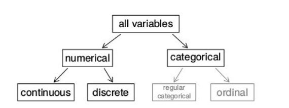
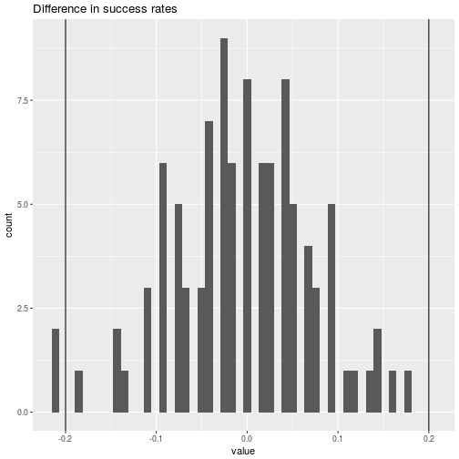
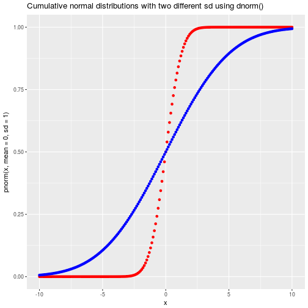

Introductory Statistics
========================================================
author: Wim van der Ham
date: 2018-02-04
autosize: true


Type of Data Collection
========================================================

Observational Study -> Association

Randomized Experiment -> Causation

Type of Variables
========================================================



Mean
========================================================

> The sample mean of a numerical variable is the sum of all of the observations
divided by the number of observations:


Mean - R
========================================================


```r
data_1 <- c(3, 5, 8, 9, 600)
data_2 <- c(60, 3, 5, 9, 8)
data_3 <- c(3, 4, 5, 90)
mean(data_1)
mean(data_2)
mean(data_3)
```

Variance
========================================================

> The variance is roughly the average squared distance from the mean. The standard
deviation is the square root of the variance and describes how close the data are
to the mean.


Variance - R
========================================================


```r
var(data_1)
var(data_2)

sd(data_1)

var(data_1) == sd(data_1)^2
```

Median
========================================================

> If the data are ordered from smallest to largest, the median is the observation
right in the middle. If there are an even number of observations, there will be two
values in the middle, and the median is taken as their average.

Median - R
========================================================


```r
median(data_1)
median(data_2)
```

The median is less sensitive to outliers than the mean.

Random Numbers - Discrete
========================================================

- Flipping a coin
- Throwing a dice


```r
# seed
set.seed(5)

sample(1:10, 2)
#sample(1:10, 20)
sample(1:10, 20, replace =TRUE)
```

Random Numbers - Continuous
========================================================

- Weight
- Height
- Temperature


```r
runif(10)
runif(10, 5.0, 7.5)
```

Example - Dice
========================================================

- Throwing a normal dice 1000 times
- Throwing a 10-sided dice 1000 times


```r
dice <- sample(1:6, 1000, replace = TRUE)
mean(dice)
sd(dice)

dice_10 <- sample(1:10, 1000, replace = TRUE)
mean(dice_10)
sd(dice_10)
```

Data from an Experiment
========================================================

Research question:

> Is a specific treatment working?


```
# A tibble: 2 x 3
        cat success failure
      <chr>   <dbl>   <dbl>
1   control      56      19
2 treatment      41      34
```

Point Estimate
========================================================


```r
# ratio of success for control group
p_success_control <- 19 / (19 + 56)
# ratio of success for treatment group
p_success_treatment <- 34 / (34 + 41)
# difference in success rates
(34 / (34 + 41)) - (19 / (19 + 56))
```

```
[1] 0.2
```

Hypothesis
========================================================

**H<sub>0</sub>**: Null hypothesis. The outcome is **not** dependent on the treatment.

**H<sub>A</sub>**: Alternative hypothesis. The outcome is dependent on the treatment.

Simulation
========================================================


```r
simulated_point_estimates <- 
  data_frame(value = seq(1:100)) %>%
  mutate(value = 1:100 %>%
    map_dbl(function(i) {
      success_rate_treatment <- sum(
        runif(75) > 0.5
      ) / 75
      success_rate_control <- sum(
        runif(75) > 0.5
      ) / 75
      success_rate_treatment - success_rate_control
    }))
mean(simulated_point_estimates$value)
```

```
[1] -0.004933333
```

Distribution
========================================================



***

**Conclusion:** 

The probability that the point estimate (20%) was found due to chance is smaller than 5% so we reject the **H<sub>0</sub>** and accept the **H<sub>A</sub>**

p-value
========================================================

> The **p-value** is the probability of observing data at least as favorable to the alter
native hypothesis as our current data set, if the null hypothesis were true.

**p-value** lower than 0.05 means in general the result is statistically significant

Why 0.05? [A lady tasting tea](https://en.wikipedia.org/wiki/Lady_tasting_tea)

Type of Errors
========================================================

| | do not reject H<sub>0</sub> | reject H<sub>0</sub> in favor of H<sub>A</sub> |
| --- | --- | --- |
| H<sub>0</sub> true | okay | Type 1 Error |
| H<sub>A</sub> true | Type 2 Error | okay |

The significance level selected for a test should reflect the real-world consequences
associated with making a Type 1 or Type 2 Error.

Central Limit Theorem
========================================================

> If we look at a proportion (or difference in proportions) and the scenario satisfies
certain conditions, then the sample proportion (or difference in proportions) will
appear to follow a bell-shaped curve called the normal distribution.

**Conditions:**
- Observations in the sample are independent
- The sample is large enough

Normal Distribution
========================================================


Normal Distribution - R
========================================================


```r
dnorm(0, mean = 1, sd = 1)
```

```
[1] 0.2419707
```

```r
pnorm(1, mean = 0, sd = 1)
```

```
[1] 0.8413447
```

Normal Distribution - R plots
========================================================


***



Z - score
========================================================

$Z = \frac{x − μ}{σ}$

> The Z score of an observation is the number of standard deviations it falls above
or below the mean. We compute the Z score for an observation x that follows a
distribution with mean μ and standard deviation σ

Z score in a hypothesis test
========================================================

In the context of a hypothesis test, the Z score for a point estimate is

$Z = \frac{point estimate − null value}{SE}$

The standard error in this case is the equivalent of the standard deviation of the
point estimate, and the null value comes from the null hypothesis.

Conditions for Applying the Normal Distribution
========================================================

1. Observations are Independent
  - **Experiment:** Randomly assigned to a group and no contact between groups
  - **Sample:** Less than 10% of the population
1. At least 10 successes and 10 failures in our sample

Calculate the Standard Error
========================================================

$SE_{p_1-p_2} = \sqrt{\frac{p_1(1-p_1)}{n_1}+\frac{p_2(1-p_2)}{n_2}}$


```r
SE <- sqrt(
  (p_success_control * 
     (1 - p_success_control)) 
  / 75 + 
  (p_success_treatment * 
     (1 - p_success_treatment)) 
  / 75
)
SE
```

```
[1] 0.07633066
```

Calculate the Z-score
========================================================

$Z = \frac{point estimate − null value}{SE}$


```r
Z <- (0.2 - 0) / SE
Z
```

```
[1] 2.620179
```

Calculate the p-value
========================================================


```r
p <- (1 - pnorm(Z, mean = 0, sd = 1)) * 2
p
```

```
[1] 0.008788364
```

```r
p < 0.05
```

```
[1] TRUE
```

Note
========================================================

This information is enough to continue. Now some more advanced topics are explained.

t distribution
========================================================

> *t* distribution is simmilar to the normal distribution but with thicker tails. Therefore the *t* distribution works better for small (<30) sample sizes.

In stead of calculating a Z score based on the normal distribution you calculate a T score based on the *t* distribution. Conceptually they are the same.

Example - Game
========================================================

Two players play a game.

- Player A won 8 times.
- Player B won 4 times.

Is player A better than player B?

Example - Game
========================================================

Two players play a game.

- Player A won 20 times.
- Player B won 10 times.

Is player A better than player B?

Hypotheses - Game
========================================================

**H<sub>0</sub>**: The quality of the players is the same.

**H<sub>A</sub>**: One of the players is better

Calculate the Standard Error - Game
========================================================

$SE_{p} = \sqrt{\frac{p(1-p)}{n}}$


```r
SE <- sqrt(
  (0.5 * (1 - 0.5)) / 30
)
SE
```

```
[1] 0.09128709
```

Calculate the T-score
========================================================

$T = \frac{point estimate − null value}{SE}$


```r
t <- (0.67 - 0.5) / SE
t
```

```
[1] 1.862257
```

Calculate the p-value
========================================================


```r
df <- 30 - 1
p <- (1 - pt(t, df)) * 2
p < 0.05
```

```
[1] FALSE
```

<!-- Confidence Intervals -->
<!-- ======================================================== -->

<!-- For a 95% confidence interval: -->

<!-- $point estimate ± 1.96 × SE$ -->

<!-- Because: -->

<!-- ```{r} -->
<!-- pnorm(1.96, 0, 1) - pnorm(-1.96, 0, 1) -->
<!-- ``` -->

<!-- Confidence Intervals -->
<!-- ======================================================== -->

<!-- ```{r} -->
<!-- (p_success_treatment - p_success_control) - 1.96 * SE -->
<!-- (p_success_treatment - p_success_control) + 1.96 * SE -->
<!-- ``` -->

<!-- ANOVA -->
<!-- ======================================================== -->

<!-- - Method for comparing the mean between different groups -->
<!-- - Compensates for many pairwise comparisons -->

<!-- **H<sub>0</sub>**: Null hypothesis. All the means of the groups are equal. -->

<!-- **H<sub>A</sub>**: Alternative hypothesis. At least one mean is different. -->

<!-- ANOVA - Conditions -->
<!-- ======================================================== -->

<!-- 1. Observations are independent within and across groups -->
<!-- 1. Data within each group are nearly normal -->
<!-- 1. Variability across the groups is about equal -->

<!-- F - test -->
<!-- ======================================================== -->
