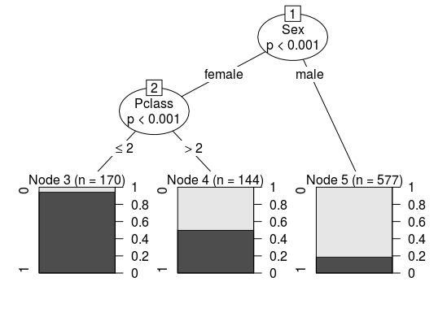

Trees and Forests
========================================================
author: Wim van der Ham
date: 2018-06-01
autosize: true

Overview
========================================================


Decision Trees
========================================================

- Supervised learning
- Both **Regression** and **Classification**
- Devise the data in groups using a **top-down**, **greedy** method
- Make the same prediction for every group, using the mean or the most occurred value of the group

In R: `party::ctree()` or `rpart::rpart()`

Simple Example Tree
========================================================



Over-fitted Tree
========================================================


Pruning
========================================================

1. First train a large tree that only stops splitting when the groups are smaller than a threshold.
1. Like with Lasso, introduce a penalty for the number of leaves a tree has.
1. Use Cross-Validation to get the best value for this parameter.
1. Pick the tree for the best value of the parameter.

**This is all done by R!**

Regression and Classification
========================================================

- For regression trees the **$RSS$** is used to calculate the best split
- For classification trees the **Gini index** is used

Gini Index
========================================================

> Total variance across the different classes


Gini Index - Example
========================================================

If the Gini value is small the node is more *pure*


```r
0.5 * (1 - 0.5) + 0.5 * (1 - 0.5)
```

```
[1] 0.5
```

```r
0.2 * (1 - 0.2) + 0.8 * (1 - 0.8)
```

```
[1] 0.32
```

**This is all done by R!**

Trees vs Linear Models
========================================================

- Easy to explain in a graphical way to people
- Less predictive than linear models, only when the data is very non-linear
- Not robust, small changes in the data can result in big changes in the tree

The last point can be improved a lot by using...

Random Forest
========================================================

- Combination of many imperfect Decision Trees
- Bagging is used to create a random training set for every tree
- For every split only a random subset of $m ≈ \sqrt{p}$ variables is available, this to have a bigger varinace between trees

Out-of-Bag Error Estimation
========================================================


```r
# Bagging ~ 66% of the data is used
sample(1:10, replace = TRUE)
```

```
 [1] 6 4 4 5 8 5 7 7 4 3
```

The data not used, *Out-of-Bag* can be used for validation

Results are close to Cross-Validation but computationally less expensive

Regression and Classification
========================================================

- **Regression** average the predicted responses
- **Classification** take a majority vote
