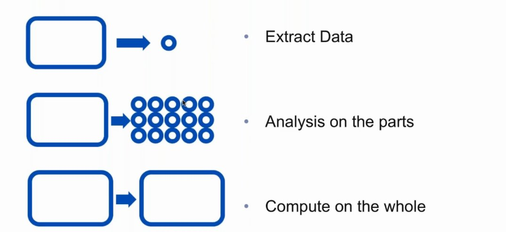

Reading Data
========================================================
author: Wim van der Ham
date: 2018-05-31
autosize: true

Reading Data from File
========================================================

- `read_csv()` reads comma delimited files 
- `read_csv2()` reads semicolon separated files (common in countries where , is used as the decimal place) 
- `read_tsv()` reads tab delimited files
- `read_delim()` reads files with any delimiter

stringsAsFactors
========================================================

- Old reading functions have a `.` between words
- They by default convert `strings` to `factors` because of old R memory usage


```r
paris_paintings_old <- read.csv(
  "./datasets/paris_paintings.csv", 
  stringsAsFactors = TRUE
)
paris_paintings_tv <- read_csv("./datasets/paris_paintings.csv")
```

Write Data to File
========================================================

- `write_csv()` writes comma delimited files 
- `write_tsv()` writes tab delimited files
- `write_delim()` writes files with any delimiter

Reading and Writing to a R Data File
========================================================

`readRDS()`

`saveRDS()`

Reading from Excel Files
========================================================

- Functions are in the [readxl](http://readxl.tidyverse.org/) package
- `read_excel()` function for reading the excel file
- `excel_sheets()` function for getting all the sheets

Reading from Other Statistical Packages
========================================================

Functions are in the [haven](http://haven.tidyverse.org/) package

Reading from Databases
========================================================


Connection Pane in Rstudio v1.1
========================================================

- View databases, schemas, tables and fields
- Explore data in tables or views
- Remembers connections you have made

Type of Problems
========================================================



Doing Calculations using the Database
========================================================

- Use `dplyr` to make data transformation commands
- `compute()` stores the data in a remote temporary table
- `collect()` retrieves data into a local data frame

Connecting to MySQL
========================================================

Example in `read_mysql.R`

Making Graphics using the Database
========================================================

Using [dbplot](https://rviews.rstudio.com/2017/08/16/visualizations-with-r-and-databases/)

- Only plot summaries
- Make this summaries on the database

Example in `read_mysql.R`

Connecting to Mongo
========================================================

Using [mongolite](https://jeroen.github.io/mongolite/)

Example in `mongo.R`
