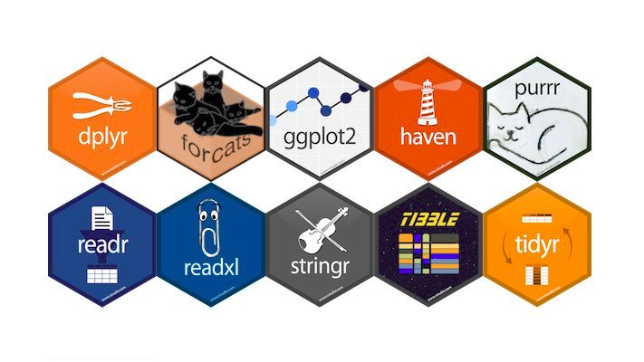

Introduction
========================================================
author: Wim van der Ham
date: 2018-06-02
autosize: true

About Myself
========================================================

Wim van der Ham 

wfjvdham@gmail.com

Master Human Media Interaction (AI)

***

**Experience:**

- Randommonkey
- Mercadoni
- Quby
- Teaching R and ML

About You?
========================================================

- What is your level of experience with R?
- What would you like to learn in this course?

About This Course
========================================================

- Flexible
- Practical
- [GitHub](https://github.com/wfjvdham/Rcourse)
- [More References](https://github.com/wfjvdham/Rcourse/blob/master/references.md)

About R
========================================================

A language that is good at: 
  - Reading data
  - Analyzing data
  - Modeling
  - Making graphics
  - Presenting results

About R
========================================================  

- All data is loaded in memory
- Open-source
- A lot of packages are available
  - [CRAN](https://cran.rstudio.com/)
  - [Bioconductor](https://www.bioconductor.org/)
  - [GitHub](https://github.com)

Style
========================================================  

[The tidyverse style guide](http://style.tidyverse.org/)

**Tools**

- [styler](http://styler.r-lib.org/index.html)
- [lintr](https://github.com/jimhester/lintr)

R Work Flow
========================================================

R Installation
========================================================

R

https://cran.r-project.org/

RStudio

http://www.rstudio.com/download

R Studio
========================================================

- Content of Files
- Console
- Environment, History, Connections, ...
- Files, Plots, Packages, Help, Viewer

Tidyverse
========================================================

https://www.tidyverse.org/

Use Packages
========================================================

Install - one time

`install.packages("tidyverse")`

Load - every time you start with using R

`library("tidyverse")`

