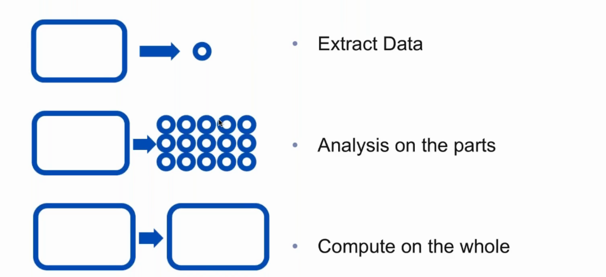
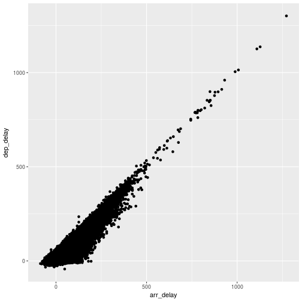
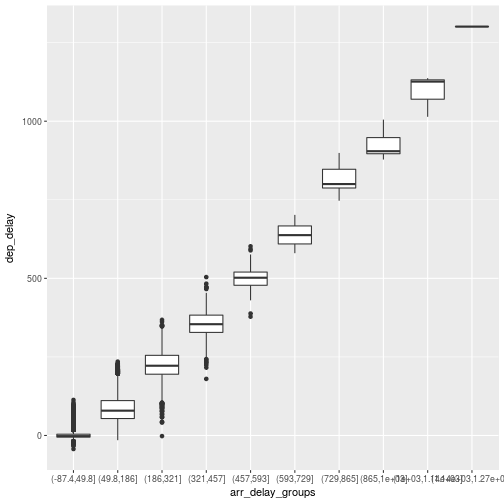

Introduction
========================================================
author: Wim van der Ham
date: 2018-06-18
autosize: true

What is Big Data?
========================================================

Sometimes defined using the 5 V's:

* **Volume** The quantity of generated and stored data
* **Variety** The data comes from a lot of different sources, like web pages, images, text, audio, video
* **Velocity** The speed at which the data is generated
* **Veracity** The data quality of captured data can vary greatly
* **Value**

But in general definition is unclear

What is Big Data when using R?
========================================================

Data > RAM

3 kind of Problems
========================================================

Subset
========================================================

Take only a part of your data to annelyze

* Limit the number of variables
* Limit the time period
* Use random *sampling* to reduce the size of the data

Complex Calculations
========================================================

Push any complex calculation to the database, which has more power to do them, and only collect the results in R.

* Make summaries in the database and collect the results
* Fit model in the database and collect the coefficients
* Fit model in the database, use model to make predictions and collect the results

The `collect()` function is used for collecting the results.

Making Graphics
========================================================

It does not make sense to plot all data because it will not give a clear image.

***

Making Graphics - Using Summaries
========================================================

Making Graphics - Using Summaries
========================================================

The calculation of the summaries should be done on the database, only the results should be collected in R.

The [`dbplot`](https://github.com/edgararuiz/dbplot) package does exactly that. Exercises for this can be found in the `sparklyr` chapter.
